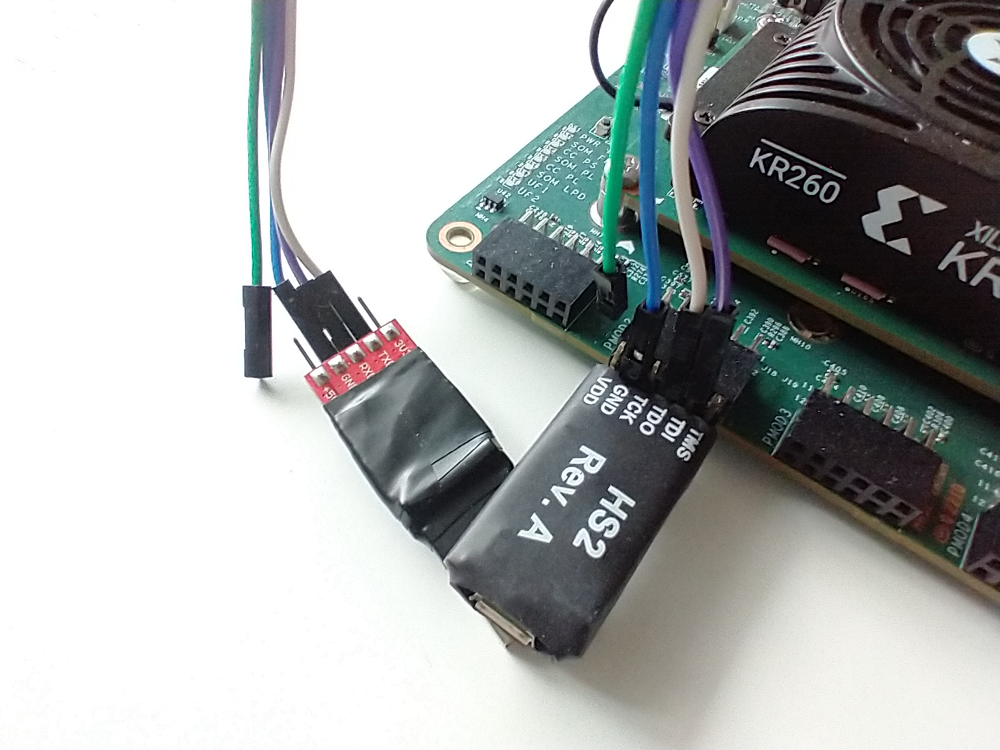
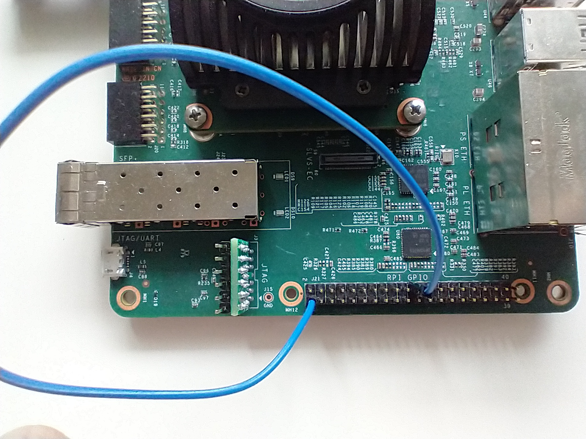

# robo-v-mcu-demo

## Introduction

The `robo-v-mcu-demo` is the SW which demonstrate the usage of the `robo-v-mcu` branch of PlanV's fork of the `core-v-mcu` repository.

## Requirements

- Xilinx/AMD KR260 board
- Xilinx Vivado (to generate the bitfile for the KR260 board)
- USB2UART connector
- JTAG debugger
- (optional) [CORE-V-SDK](http://downloads.openhwgroup.org/)

Note: the JTAG interface and the UART port are sharing the same PMOD connector (J18): a 2x6 male-male header can easily by customized to fit this purpose (see images below).

## Setup

- create a bitfile for the target board
    - `git clone --branch robo-v-mcu https://github.com/planvtech/core-v-mcu.git; cd core-v-mcu; make kr260-emul`
    - the bitfile is `build/openhwgroup.org_systems_core-v-mcu_0/kr260-vivado/openhwgroup.org_systems_core-v-mcu_0.bit`
- prepare the KR260 board
    - upload the bitfile
    - connect the JTAG debugger and the UART 
        - UART0.RX = J18.5
        - UART0.TX = J18.3
        - JTAG.TCK = J18.8
        - JTAG.TDO = J18.6
        - JTAG.TDI = J18.4
        - JTAG.TMS = J18.2
        - JTAG.TRST (J21.40) should be bound to VCC, otherwise the JTAG debugger won't connect
        
        
-   compile the demo and upload it

In case you're using OpenHW's CORE-V-SDK

- import the project contained in this repository called `demo`. To do so, follow the `core-v-mcu-cli-test` [page](https://github.com/openhwgroup/core-v-mcu-cli-test/blob/main/README.md) as a baseline until Step 4.4. 
- for Step 4.5, we want to provide the URL of this repository, so use the link https://github.com/planvtech/robo-v-mcu-demo.git
- in Step 4.9 import the `demo` project
- in Step 7.7, create a new `demo Default` configuration under `GDB OpenOCD Debuggin`. For simplicity, copy the one provided with the cli test called `cli_test hs2`, and replace the `C/C++ Application` field with `Default/demo`
