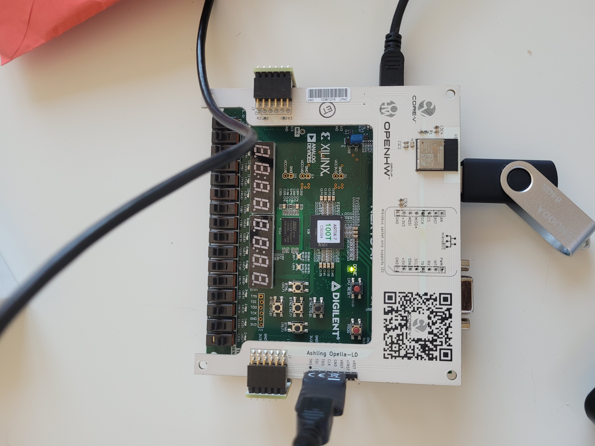

# core-v-mcu-demo

## Setup

You can run the core-v-mcu-demo with either the OpenHW Group expansion board, or with the ESP-C3-Expresslink-Devkit.

### Requirements:

#### ESP-C3-Expresslink-Devkit:
- Digilent Nexys A7 (artix7 100T) board
- ESP-C3-Expresslink-Devkit
- 3x USB2microUSB cables
- Digilent HS2 connector
- 3x jumper cables
- PMOD header male-male, 2 rows
- latest version of the FPGA bitfile, which can be found [here](http://downloads.openhwgroup.org/)

Note: I had to manually bend one row of pins in the PMOD header.

#### OpenHW Group expansion board:
- Digilent Nexys A7 (artix7 100T) board
- OpenHW Group expansion board
- Digilent HS2 connector
- PMOD header male-male, 2 rows
- latest version of the FPGA bitfile, which can be found [here](http://downloads.openhwgroup.org/)

#### CORE-V-SDK:
- Download the latest version of the CORE-V-SDK from the official [download page](http://downloads.openhwgroup.org/) and install it.
- Now import the project contained in this repository called `demo`. To do so, follow the `core-v-mcu-cli-test` [page](https://github.com/openhwgroup/core-v-mcu-cli-test/blob/main/README.md) as a baseline until Step 4.4. 
- For Step 4.5, we want to provide the URL of this repository, so use the link https://github.com/openhwgroup/core-v-mcu-demo.git. And finally, 
in Step 4.9 import the `demo` project.
- In Step 7.7, create a new `demo Default` configuration under `GDB OpenOCD Debuggin`. For simplicity, copy the one provided with the cli test called `cli_test hs2`, and replace the `C/C++ Application` field with `Default/demo`


#### ESP-C3-Expresslink-Devkit setup:

- [this page](https://github.com/espressif/esp-aws-expresslink-eval) provides useful information about how to setup the ESP board
- the ESP is expected to communicate to OpenHW's AWS IoT Core: make sure your ESP has been registered by asking OpenHW's team
- the ESP must have WiFi access; the userguide mentioned above explains how to do it; the relevant commands are also in the `iot_task.c` file (`at_set_wifi()` function), but are commented out
    - to enable the configuration of the WiFi interface
        - there must be an active UART connection with the board
        - press a key when requested
        - the ESP module goes in configuration mode and the ESP BLE must be used to provide the WiFi credentials
    - once the configuration is done, do a power cycle: this is necessary to switch off the ESP module, to bring it out of configuration mode
- the same function allows to configure the correct Endpoint: ask OpenHW's team the address of the actual endpoint

Board connections
- host PC to Nexys board (J6)
- host PC to HS2 to Nexys board (JB connector, lower row)
- host PC to ESP board
- Nexys JB.2 to ESP J13.RX
- Nexys JB.3 to ESP J13.TX
- Nexys JB.5 to ESP J13.GND

Identify the USB ports on the host PC
The host PC should see 3 /dev/ttyUSB* interfaces:
1. one used for the debugger
2. one used by the MCU to send messages via CLI_print (over UART0)
3. one used by the ESP board to send debug information

Connect via minicom (or similar) to each of the /dev/ttyUSB* device to identify them. After reset:
1. prints no information
2. prints `A2 boot`
3. prints the ESP bootlog

Running the demo:
1. power up both boards (remember: SW0 must be switched towards the inside of the board, otherwise it is not possible to connect the debugger)
2. [optional] open 2 terminals to see the debug messages
3. open CORE-V-SDK and load the `demo` project
4. compile the code
5. load the executable in the MCU
6. run

#### OpenHW Group expansion board setup:

Board connections: connect the expansion boards as shown below

<p align="center"></p>

The image shows the HS2 cable, which leaves unconnect the nTRST and nRST pins as shown below - Otherwise please connect the Opella Cable.

<p align="center"></p>

Identify the USB ports on the host PC
The host PC should see 2 /dev/ttyUSB* interfaces:
1. one used for the debugger
2. one used by the MCU to send messages via CLI_print (over UART0)

Connect via minicom (or similar) to each of the /dev/ttyUSB* device to identify them. After reset:
1. prints no information
2. prints `A2 boot`

Running the demo:
1. power up both boards (remember: SW0 must be switched towards the inside of the board, otherwise it is not possible to connect the debugger)
2. [optional] open 2 terminals to see the debug messages
3. open CORE-V-SDK and load the `demo` project
4. compile the code
5. load the executable in the MCU
6. run

Now that you load the `demo` program, on your PC, minicom will show the core-v-mcu (on the nexys) printing

```
AT check done
Thing name: **the thing name of your board**
Press a key to enter CONFMODE...10...9...
Entering CONFMODE - do a power cycle at the end of the configuration
```

The **Thing name** needs to be provided to an OpenHW Group staff member.

Press a key before the 10 seconds counter expires.

Now it's time to configure the WiFi of the expansion board, we do this with your mobile phone.

As reported in Section 6.1 of the espressif [page](https://github.com/espressif/esp-aws-expresslink-eval#61-set-up-for-wi-fi),
download the App on your phone.
Then scan with Bluetooth your device, and then add your WiFi configuration. 

If you the configuration of your network fails due to "provisioning status", you may need to reboot the nexsys board, re-load the demo project and repeat 
until success.

Once the network is set, reboot the board and re-load the demo program with the CORE-V-SDK.

Now on minicom, don't press any key as the espressif has been configured already in the previous step.

You should now see:

```
AT check done
Thing name: **the thing name of your board**
Press a key to enter CONFMODE...10...9...8...7...6...5...4...3...2...1...
WiFi configured
Topic configured
ESP connected
The temperature here (Zurich) is 30.40000 C```
```

Of course both the city and the temperature may be different.

## Dashboard
An OpenHW Group Grafana [dashboard](https://openhwgroup.grafana.net/dashboards) displays the measurements sent to the OpenHW's AWS IoT Core.
Contact the OpenHW Staff to obtain the viewer's credentials.
